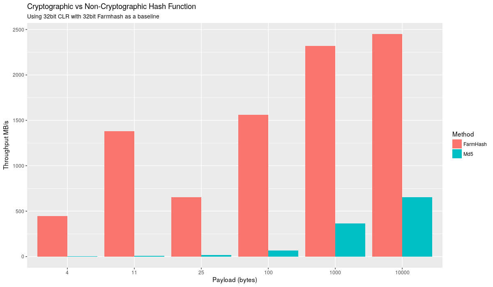
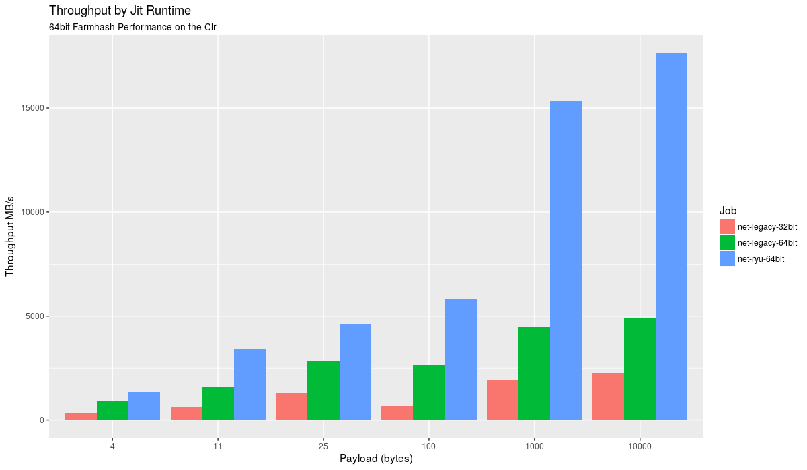
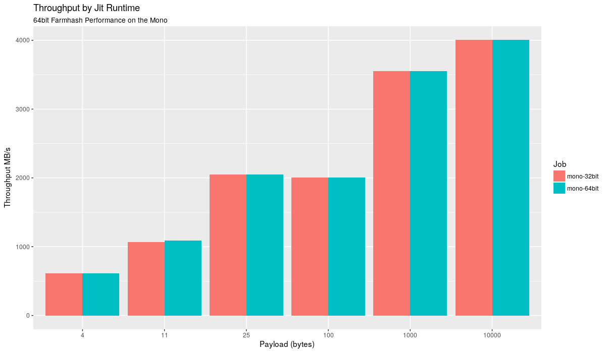
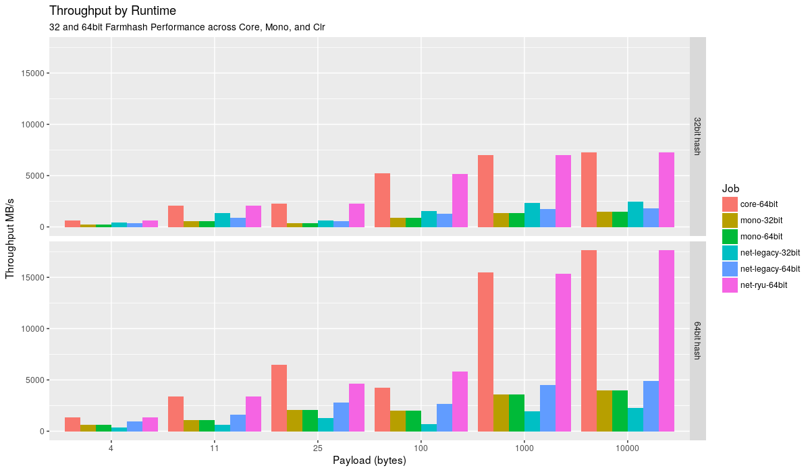
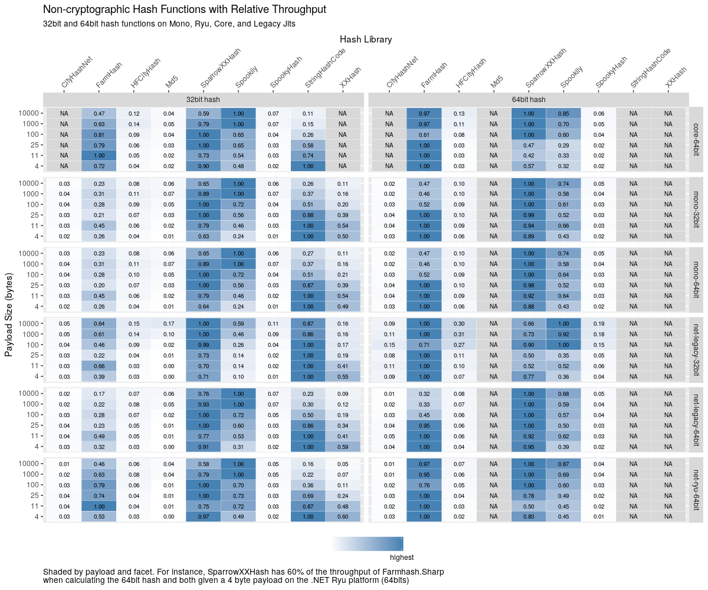
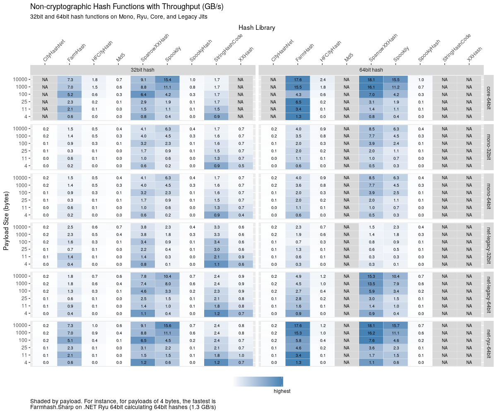
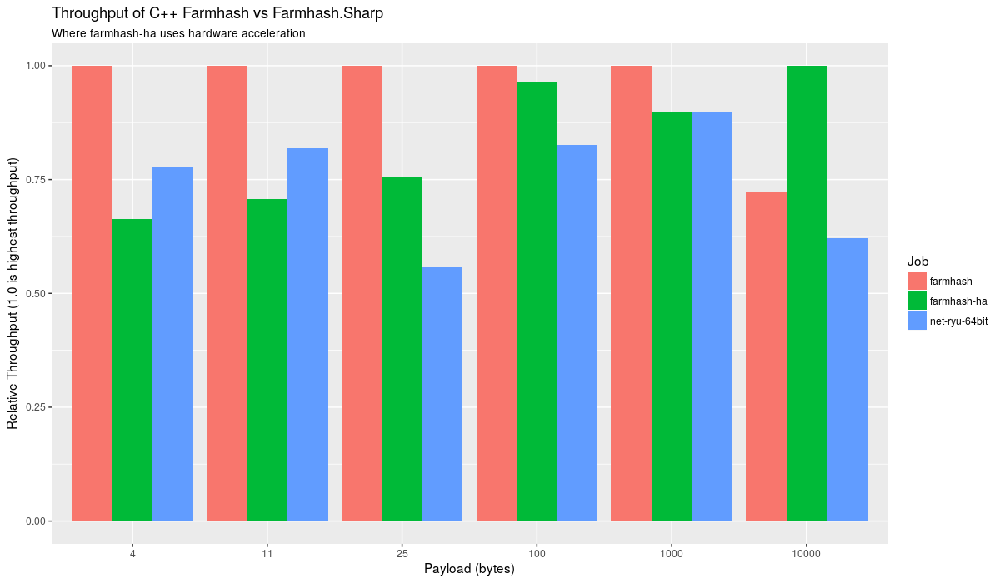

# Benchmarks

## Cryptographic vs Non-Cryptographic

For the first graph we will compare a cryptographic (albeit a bad one, as
it's MD5) with Farmhash.Sharp, which is a non-cryptographic hash function.
Whereas a non-cryptographic function only has to optimize against collisions
and speed, a cryptographic function needs to also minimize pathological input.

Without getting bogged down into too many specifics, Farmhash easily crushes
MD5.

## 32bit vs 64bit Runtime

What may be surprising is that depending on the runtime Farmhash is running on,
the throughput can be dramatically affected. To show this, I've restricted the
data to only show the 64bit hash of Farmhash across different Clr Jit runtimes to
see which Jit wins.

I suppose the .NET team should be commended, as the latest Jit (their 64bit Ryu Jit)
has 5-10x more throughput than the old Jit with results more pronounced against the
legacy 32bit Jit.

Does mono have the same behavior?

Nope. 32bit and 64bit Mono have approximately the same throughput for 64bit Farmhash.
If you have a keen eye, you may have noticed that the y axis scale changed, which naturally
lends itself to the question of how Mono, Clr, and the new Core runtime compare against
each other.

For both 32bit and 64bit Farmhash functions, the 64bit core and 64bit ryu runtimes
win across any sized payload. Both the core and ryu probably use a lot of the same
code under under the hood.

## Comparison with other libraries

The following benchmark was done:

- For each payload (4, 11, 25, 100, 1000, 10000)
  - For each platform (.NET Core 64bit, Mono 32/64, .NET legacy 32/64, .NET Ryu 64bit)
    - Determine the throughput of calculating a 32bit and 64bit hash

Please click on the image for a better look!

In each configuration, which library has the highest relative throughput compared to competitors in the same row?

Previous heatmap detailed relative throughput, but that was for each facet's
(configuration's) payload size. How can one tell what configuration yields the
highest throughput at a given payload size. Welcome to the next heatmap.

What are some takeaways? Well, if you are constrained to a platform you are
deploying, you'll choose the library that performed the best relative to others
according to your constraints. If you're interested in highest throughput:

- Stick with 64bit hash functions
- Stick with either .NET Core or .NET Ryu
- For small payloads (~ 11 bytes) use Farmhash.Sharp
- For larger payloads, Farmhash.Sharp remains competitive, but [XXHash](https://github.com/ravendb/ravendb/blob/b87a422e91dcf7d4590bad631c9266258be7cab3/Raven.Sparrow/Sparrow/Hashing.cs) found within the Sparrow module of RavenDB is a good option as well.

## C# vs. C++

A good question would be how much efficiency is lost because we're using
C# and not C++, as the original farmhash algorithm uses C++. You can find the
benchmark code [here](https://github.com/nickbabcock/Farmhash.Sharp/tree/5ef3ffc22a1b70b7875dc0b5ae73be496a45fb28/src/Farmhash.Benchmarks).
It uses two versions of the algorithm, one that uses hardware acceleration
([SIMD](https://en.wikipedia.org/wiki/SIMD) instructions), denoted by `-ha`
in the graph, and another compilation that does not use hardware acceleration.

I'm pleased to report that for small payloads (<= 25 bytes), Farmhash.Sharp
is around about the fastest if not the fastest. It's only at larger payloads
do we see C++'s lead extend as hardware acceleration becomes more effective.
Still, for large payloads, Farmhash.Sharp has half the throughput as hardware
accelerated C++, which in my opinion, is quite impressive. 

## Conclusion

When deploying on a 64bit application, always choose the 64bit Farmhash
version. If, for whatever reason, Farmhash isn't for you, choose xxHash found
in Ravendb.

Code used to generate the graphs can be found in analysis.R in the github repo.